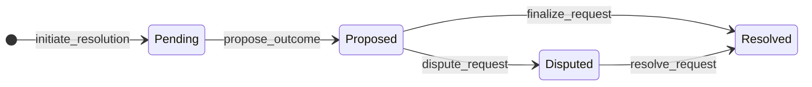

# Resolution Design

Multi-leg requests are **parlays**: one combined bet across all legs. The requester buys YES on the parlay — it pays only if every leg hits YES. Otherwise the parlay is NO.

Example: leg 1 = Portugal beats Nigeria, leg 2 = Spain beats Brazil. Parlay YES means both results are YES. Parlay NO means anything else (one loss, both losses, etc.).

## Request-level resolution states

Resolution is one state machine per **request**, not per leg. Legs only accumulate **component outcomes** (did Portugal win? did Spain win?) while the parlay waits.

| Status | Meaning | Disputes open? | Funds move? |
|--------|---------|----------------|-------------|
| `pending` | Collecting leg component outcomes | no | no |
| `proposed` | Parlay outcome proposed (computed from legs) | **yes** | no |
| `disputed` | Counterparty challenged the proposal | no (arbitrator decides) | no |
| `resolved` | Terminal parlay outcome applied to all escrows | no | yes |

**Rule:** locked funds never move until the request reaches `resolved`. All legs settle together in one payout.

## Parlay outcome logic

Once every leg has a `component_outcome` (`YES`, `NO`, or `VOID`):

| Leg components | Parlay outcome |
|----------------|----------------|
| all `YES` | `YES` |
| any `VOID` | `VOID` (refund entire parlay) |
| otherwise | `NO` |

`propose_outcome(request_id)` computes this and moves the request to `proposed`. You cannot propose until **all** legs are reported — if Spain's match hasn't finished, the parlay waits.

## Fund states through resolution

| Phase | Requester | MM |
|-------|-----------|-----|
| Escrow locked | `locked` = sum of premiums | `locked` = sum of collateral |
| Pending / proposed / disputed | unchanged | unchanged |
| Resolved YES (parlay hits) | all `locked` → `available` (wins all pots) | forfeits all `locked` |
| Resolved NO (parlay misses) | forfeits all `locked` | all `locked` → `available` (wins all pots) |
| Resolved VOID | all stakes refunded | all stakes refunded |

## Happy path (unchallenged proposal)

1. `initiate_resolution(request_id)` — request → `pending`
2. `report_leg_outcome(leg_id, YES|NO|VOID)` for each leg as events complete
3. `propose_outcome(request_id)` — computes parlay, sets `dispute_deadline`, → `proposed`
4. Dispute window passes with no challenge
5. `finalize_request(request_id)` or `process_resolution_expirations()` — pays out, → `resolved`
6. `settle_request(request_id)`

No oracle lookup layer in the MVP — the caller supplies component outcomes directly.

## Dispute window

On `propose_outcome`, the engine stores `dispute_deadline = now + DISPUTE_WINDOW_SECONDS`. While `now <= dispute_deadline` and status is `proposed`, either counterparty may call `dispute_request`. After the deadline, disputes are rejected with `DisputeWindowExpiredError`.

A worker calls `process_resolution_expirations(at)` to auto-finalize unchallenged proposals past `dispute_deadline`.

## Disputed resolution

Disputes challenge the **parlay proposal**, not individual legs in isolation. Either counterparty calls `dispute_request(request_id)` while `proposed`.

| Step | Request status | Funds |
|------|----------------|-------|
| all legs reported + `propose_outcome` | `pending` → `proposed` | locked |
| `dispute_request` | `proposed` → `disputed` | locked |
| arbitrator `resolve_request(outcome)` | `disputed` → `resolved` | payout or refund |

While disputed, all escrows stay frozen. An arbitrator calls `resolve_request` with the final parlay YES/NO/VOID (may override the computed proposal).

## Delayed resolution

If any leg's event has not occurred, that leg has no `component_outcome` and the parlay cannot be proposed. Capital stays locked across **all** legs until the last event is reported and the parlay resolves.

## Ambiguous contract wording

If any leg's component is `VOID` (unresolvable contract), the parlay outcome is `VOID` and all escrows are refunded. The whole parlay is void — legs do not settle independently.

## Multi-leg matching (parlay)

Multi-leg requests are parlays. Matching does **not** pick the best quote per leg independently. Instead:

1. Find MMs with a valid quote on **every** leg
2. For each such MM, compute **parlay price** = product of that MM's leg prices (`p₁ × p₂ × …`)
3. Select the MM with the **lowest** parlay price (best for the requester buying YES)
4. Mark that MM's quotes `selected` and store `parlay_price` on the request

Escrow still locks per-leg premium/collateral at each leg's quoted price. Settlement uses the parlay outcome across all legs together.

## Multi-leg invariant

**Legs never resolve or pay out independently.** One leg cannot be `disputed` while another is already `resolved`. The request waits until every leg is reported, then proposes, disputes, and finalizes as a single unit.
