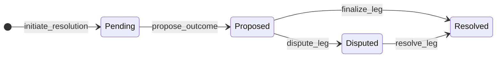

# Resolution Design

## Per-leg resolution states



| Status | Meaning | Disputes open? | Funds move? |
|--------|---------|----------------|-------------|
| `pending` | Event not yet reported / no outcome proposed | no | no |
| `proposed` | Authority proposed YES, NO, or VOID | **yes** | no |
| `disputed` | Counterparty challenged the proposal | no (arbitrator decides) | no |
| `resolved` | Terminal outcome applied | no | yes |

**Rule:** locked funds never move until a leg reaches `resolved`. Pending, proposed, and disputed legs leave both sides' locked balances untouched.

## Fund states through resolution

| Phase | Requester | MM |
|-------|-----------|-----|
| Escrow locked | `locked` = premium | `locked` = collateral |
| Pending / proposed / disputed | unchanged | unchanged |
| Resolved YES (buyer) | `locked` → `available` (wins full pot) | forfeits `locked` |
| Resolved NO (buyer) | forfeits `locked` | `locked` → `available` (wins full pot) |
| Resolved VOID (ambiguous) | `locked` → `available` (refund) | `locked` → `available` (refund) |

## Happy path (unchallenged proposal)

1. `initiate_resolution` — each leg → `pending`
2. `propose_outcome(leg_id, YES|NO)` — leg → `proposed`, outcome stored, `dispute_deadline` set
3. Dispute window passes with no challenge
4. `finalize_leg(leg_id)` or `process_resolution_expirations()` — applies the proposed outcome, leg → `resolved`
5. `settle_request` once all legs are `resolved`

No oracle lookup layer in the MVP — the caller supplies the proposed outcome directly.

## Dispute window

Venue policy constant: `DISPUTE_WINDOW_SECONDS` (2 hours, Polymarket-style — longer than the accept window so counterparties can review the proposed outcome).

On `propose_outcome`, the engine stores `dispute_deadline = now + DISPUTE_WINDOW_SECONDS` on the resolution row. While `now <= dispute_deadline` and status is `proposed`, either counterparty may call `dispute_leg`. After the deadline, disputes are rejected with `DisputeWindowExpiredError`.

A worker calls `process_resolution_expirations(at)` to auto-finalize unchallenged proposals whose `dispute_deadline` has passed. Manual `finalize_leg` is also allowed before or after the deadline (still requires `proposed` status).

## Disputed resolution

Disputes are only valid while a leg is `proposed`. Either counterparty calls `dispute_leg(leg_id)` to challenge the proposal.

| Step | Leg status | Funds |
|------|------------|-------|
| `propose_outcome` | `pending` → `proposed` | locked |
| `dispute_leg` | `proposed` → `disputed` | locked (no movement) |
| arbitrator `resolve_leg(outcome)` | `disputed` → `resolved` | payout or refund |

While disputed:

- Both parties' locked amounts stay frozen.
- `settle_request` is blocked.
- An external arbitrator calls `resolve_leg` with the final YES/NO/VOID (may differ from the proposal).

`dispute_leg` fails on `pending` (nothing to challenge yet) and on `disputed`/`resolved` (already past the dispute window).

## Delayed resolution

If the underlying event has not occurred or the oracle has not reported, the leg stays `pending`. No proposal means no dispute window and no payout.

Production hardening would add a `resolution_deadline` policy (e.g. auto-propose `VOID` after N days), but the invariant holds: **no payout without reaching `resolved`**.

## Ambiguous contract wording

When the contract cannot map to YES or NO, the authority proposes `VOID`:

```
propose_outcome(leg_id, ResolutionOutcome.VOID)
```

If unchallenged, `finalize_leg` refunds both parties via `refund_escrow`. If disputed, the arbitrator confirms or overrides with `resolve_leg(leg_id, VOID)`.

## Multi-leg

Each leg moves through the state machine independently. One leg can be `disputed` while siblings are already `resolved`; `settle_request` waits until all legs are terminal.
