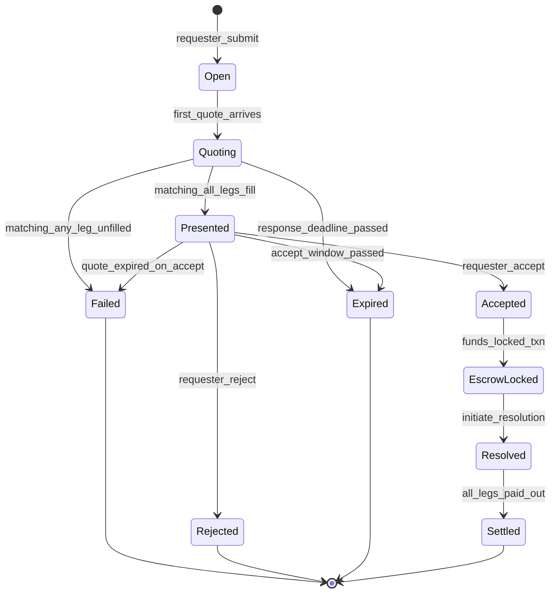
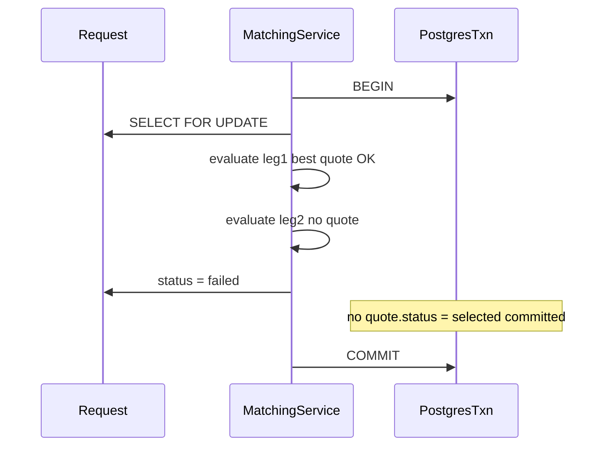

# State Machine

## Request lifecycle

## Transitions

| From | To | Trigger | Actor |
|------|-----|---------|-------|
| — | Open | `submit_request` | Requester |
| Open | Quoting | first quote submitted | MM |
| Quoting | Presented | `run_matching`, all legs have valid best quote | System |
| Quoting | Failed | `run_matching`, any leg unfilled | System |
| Presented | Accepted | `accept` | Requester |
| Presented | Rejected | `reject` | Requester |
| Presented | Expired | `process_expirations` | System |
| Presented | Failed | `accept` with expired quote | System |
| EscrowLocked | Resolved | `initiate_resolution` | System |
| Resolved | Settled | `settle_request` after parlay resolved | System |

## Per-leg quote substates

| State | Meaning |
|-------|---------|
| `active` | MM quote live; collateral reserved |
| `selected` | Best quote chosen for leg; awaiting accept |
| `rejected` | Competing quote or request rejected; reservation released |
| `expired` | Accept window passed; reservation released |

## Multi-leg partial failure

**Scenario:** 3-leg request; legs 1 and 3 quoted; leg 2 has no valid quote.

Leg 1 never durably reaches `selected` because matching evaluates all legs in one transaction before writing any `selected` status. If we naïvely committed leg 1 first, leg 1's MM would be bound while the request is unfilled — capital leak risk. Our design selects all or none.

On `failed`, active quote reservations remain (MM can let quotes expire or withdraw in a future extension).
