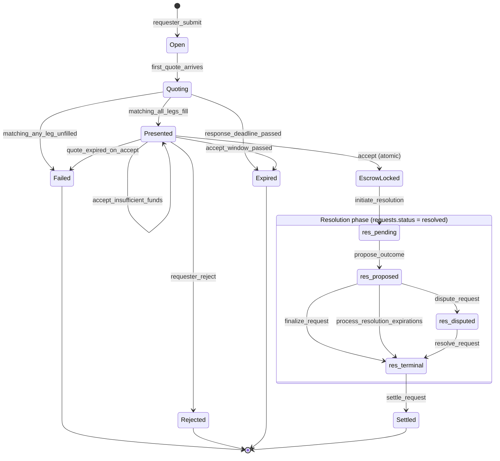
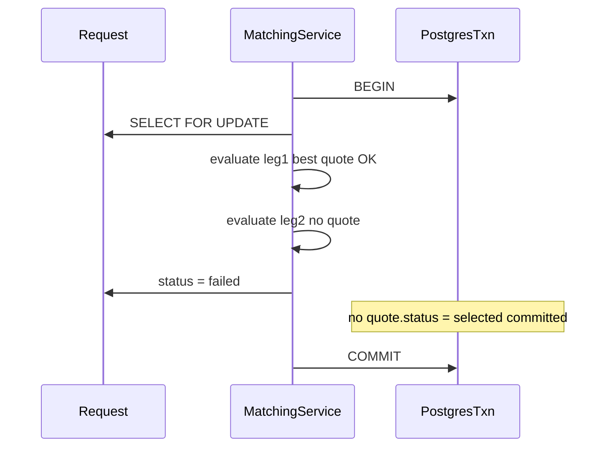

# State Machine

## Request lifecycle

## Transitions

| From | To | Trigger | Actor |
|------|-----|---------|-------|
| — | Open | `submit_request` | Requester |
| Open | Quoting | first quote submitted | MM |
| Quoting | Presented | `run_matching`, one MM quotes all legs; lowest `∏ pᵢ` wins | System |
| Quoting | Failed | `run_matching`, no MM covers all legs | System |
| Presented | EscrowLocked | `accept` — locks both sides' funds in one txn | Requester |
| Presented | Presented | `accept` with insufficient requester or MM funds — txn rolls back | Requester |
| Presented | Rejected | `reject` | Requester |
| Presented | Expired | `process_expirations` | System |
| Presented | Failed | `accept` with expired quote | System |
| EscrowLocked | `resolutions.status = pending` | `initiate_resolution` — also sets `requests.status = resolved` | System |
| `pending` | `pending` | `report_leg_outcome` (no status change until all legs reported) | System |
| `pending` | `proposed` | `propose_outcome` — computes parlay, sets `dispute_deadline` | System |
| `proposed` | `disputed` | `dispute_request` (within dispute window) | Counterparty |
| `proposed` | `resolved` | `finalize_request` or `process_resolution_expirations` — **funds move** | System |
| `disputed` | `resolved` | `resolve_request(outcome)` — arbitrator payout — **funds move** | Arbitrator |
| `resolutions.status = resolved` | `settled` | `settle_request` — sets `requests.status = settled` | System |

Resolution substates (`pending` / `proposed` / `disputed` / `resolved`) live on the `resolutions` row. See `docs/resolution_design.md` for parlay outcome logic and dispute policy.

## Accept is atomic (no `accepted` status)

`accept` moves the request straight from `presented` to `escrow_locked` inside a single DB transaction. There is no intermediate `accepted` row in `requests.status` — if escrow locking fails (e.g. balance spent since matching), the whole txn rolls back and the request stays `presented`. See `docs/failure_modes.md` for handled races.

## Resolution uses two status columns

`requests.status` and `resolutions.status` diverge after escrow:

| Phase | `requests.status` | `resolutions.status` | Funds |
|-------|-------------------|----------------------|-------|
| Escrow locked | `escrow_locked` | — | locked |
| Collecting leg outcomes | `resolved` | `pending` | locked |
| Proposal open for dispute | `resolved` | `proposed` | locked |
| Arbitrator review | `resolved` | `disputed` | locked |
| Outcome applied | `resolved` | `resolved` | **moved** (payout / refund) |
| Terminal | `settled` | `resolved` | done |

`requests.status = resolved` means "in the resolution pipeline", not "outcome finalized". Funds never move until `resolutions.status` reaches `resolved` via `finalize_request`, `process_resolution_expirations`, or `resolve_request`. `settle_request` is a bookkeeping step that marks the request `settled` after payout.

## Per-leg quote substates

| State | Meaning |
|-------|---------|
| `active` | MM quote live; no funds moved until accept |
| `selected` | Best quote chosen for leg; awaiting accept |
| `rejected` | Competing quote or request rejected; reservation released |
| `expired` | Accept window passed; reservation released |

## Multi-leg partial failure

**Scenario:** 3-leg request; legs 1 and 3 quoted by MM_A; leg 2 has no quote from any MM who also covers legs 1 and 3.

Leg 1 never durably reaches `selected` because matching evaluates all legs in one transaction before writing any `selected` status. If we naïvely committed leg 1 first, leg 1's MM would be bound while the request is unfilled — capital leak risk. Our design selects all or none.

On `failed`, active quotes remain (no capital was held).
